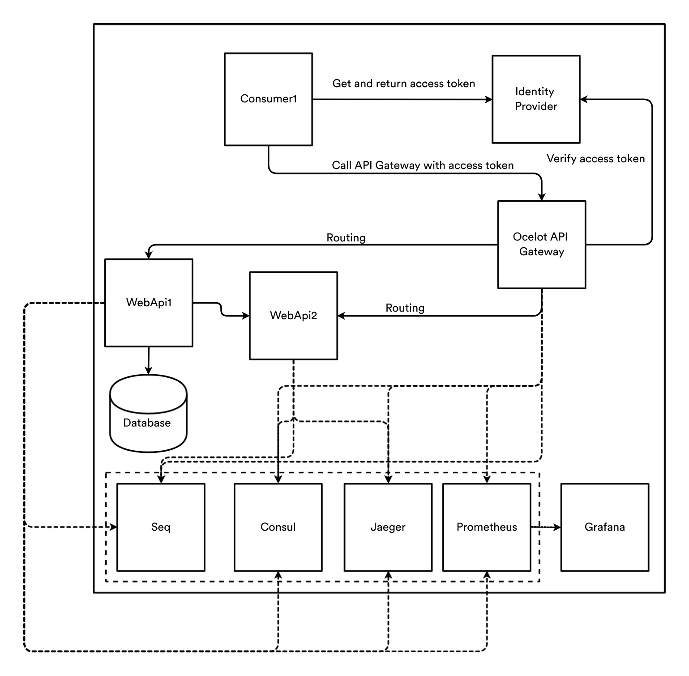
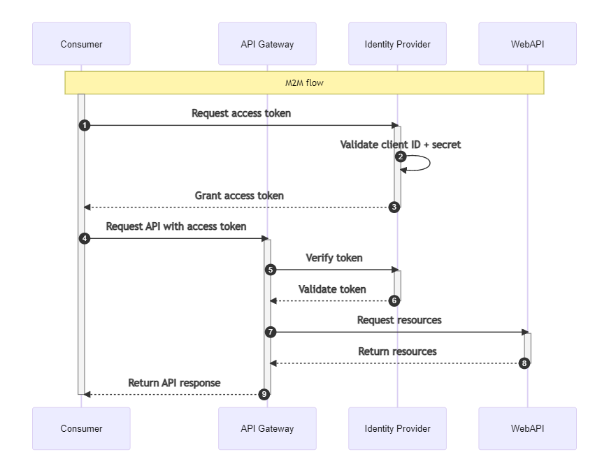

# Demo project
Demo project using Ocelot gateway, Identityserver4, Seq, Jaeger, Prometheus, Grafana

## High architecture

## Request flow

## Description
- API Gateway: Ocelot Gateway
- Identity Provider: IdentityServer4
## How to run
- Prepare infrastructure: docker-compose up -d
- Open solution and F5
- Call API from ConsumerApplication1 to test result
- View traces of request in localhost:16686
- View log in localhost:5342